# Database ERD — Lodgwise AI

> Status: Design specification. This document is the diagram companion to
> [DATABASE_DESIGN.md](./DATABASE_DESIGN.md), which holds full column-level
> definitions. Rendered/derived diagram sources also live in
> `database/diagrams/`. No migrations exist yet.

---

## 1. Entity Relationship Diagram

The diagram below renders natively on GitHub (Mermaid). Attribute lists show
keys and the most significant columns only — see
[DATABASE_DESIGN.md](./DATABASE_DESIGN.md) for complete definitions.

```mermaid
erDiagram
    %% ── Tenancy & access ──────────────────────────────────────────
    organizations ||--o{ memberships : "grants access via"
    users         ||--o{ memberships : "belongs through"
    roles         ||--o{ memberships : "assigned in"
    organizations ||--o{ roles : "defines custom"
    roles         ||--o{ role_permissions : "has"
    permissions   ||--o{ role_permissions : "granted by"

    %% ── Property management ───────────────────────────────────────
    organizations  ||--o{ properties : "owns"
    property_types ||--o{ properties : "classifies"
    properties     ||--o{ unit_types : "defines"
    unit_types     ||--o{ units : "realized as"
    properties     ||--o{ units : "contains"
    properties     ||--o{ property_amenities : "offers"
    amenities      ||--o{ property_amenities : "listed in"
    unit_types     ||--o{ unit_type_amenities : "offers"
    amenities      ||--o{ unit_type_amenities : "listed in"

    %% ── Guests & bookings ─────────────────────────────────────────
    organizations ||--o{ guests : "maintains"
    properties    ||--o{ bookings : "receives"
    guests        ||--o{ bookings : "makes"
    bookings      ||--o{ booking_items : "itemized by"
    unit_types    ||--o{ booking_items : "sold as"
    units         ||--o{ booking_items : "assigned to"
    bookings      ||--o{ payments : "settled by"

    %% ── AI knowledge base ─────────────────────────────────────────
    organizations       ||--o{ knowledge_documents : "curates"
    properties          ||--o{ knowledge_documents : "scoped to"
    knowledge_documents ||--o{ embeddings : "chunked into"
    organizations       ||--o{ conversations : "hosts"
    guests              ||--o{ conversations : "participates in"
    users               ||--o{ conversations : "participates in"
    bookings            ||--o{ conversations : "contextualizes"
    conversations       ||--o{ messages : "contains"

    %% ── SaaS billing ──────────────────────────────────────────────
    organizations ||--o{ subscriptions : "subscribes via"
    plans         ||--o{ subscriptions : "priced by"
    subscriptions ||--o{ invoices : "billed by"

    organizations {
        uuid id PK
        varchar name
        varchar slug UK
        enum status
        timestamptz deleted_at
    }
    users {
        uuid id PK
        citext email UK
        varchar full_name
        boolean is_platform_admin
    }
    memberships {
        uuid id PK
        uuid tenant_id FK
        uuid user_id FK
        uuid role_id FK
        uuid_array property_ids
    }
    roles {
        uuid id PK
        uuid tenant_id FK "NULL for system roles"
        varchar code
        boolean is_system
    }
    permissions {
        uuid id PK
        varchar code UK
        varchar category
    }
    role_permissions {
        uuid role_id PK, FK
        uuid permission_id PK, FK
    }
    property_types {
        uuid id PK
        varchar code UK "hotel, villa, resort..."
        enum default_unit_kind
    }
    properties {
        uuid id PK
        uuid tenant_id FK
        uuid property_type_id FK
        varchar name
        varchar timezone
        char currency
        enum status
        timestamptz deleted_at
    }
    unit_types {
        uuid id PK
        uuid tenant_id FK
        uuid property_id FK
        varchar name
        enum unit_kind "room | bed | whole_unit"
        smallint max_occupancy
        numeric base_price
    }
    units {
        uuid id PK
        uuid tenant_id FK
        uuid property_id FK
        uuid unit_type_id FK
        varchar name
        enum status
        enum housekeeping_status
    }
    amenities {
        uuid id PK
        varchar code UK
        enum category
    }
    property_amenities {
        uuid tenant_id FK
        uuid property_id PK, FK
        uuid amenity_id PK, FK
    }
    unit_type_amenities {
        uuid tenant_id FK
        uuid unit_type_id PK, FK
        uuid amenity_id PK, FK
    }
    guests {
        uuid id PK
        uuid tenant_id FK
        varchar first_name
        varchar last_name
        citext email
        boolean is_blacklisted
        timestamptz deleted_at
    }
    bookings {
        uuid id PK
        uuid tenant_id FK
        uuid property_id FK
        uuid guest_id FK
        varchar reference UK
        enum status
        date check_in
        date check_out
        numeric total
        timestamptz deleted_at
    }
    booking_items {
        uuid id PK
        uuid tenant_id FK
        uuid booking_id FK
        enum item_type
        uuid unit_type_id FK
        uuid unit_id FK
        date stay_from
        date stay_to
        numeric total
    }
    payments {
        uuid id PK
        uuid tenant_id FK
        uuid booking_id FK
        numeric amount
        enum method
        enum status
        varchar gateway_ref UK
    }
    knowledge_documents {
        uuid id PK
        uuid tenant_id FK
        uuid property_id FK "NULL = tenant-wide"
        varchar title
        integer version
        enum status
    }
    embeddings {
        uuid id PK
        uuid tenant_id FK
        uuid document_id FK
        integer chunk_index
        vector embedding
        varchar embedding_model
    }
    conversations {
        uuid id PK
        uuid tenant_id FK
        enum kind "guest_messaging | staff_assistant"
        uuid guest_id FK
        uuid user_id FK
        uuid booking_id FK
        enum status
    }
    messages {
        uuid id PK
        uuid tenant_id FK
        uuid conversation_id FK
        enum role
        enum status
        numeric confidence
    }
    plans {
        uuid id PK
        varchar code UK
        numeric price_monthly
        jsonb limits
        boolean is_active
    }
    subscriptions {
        uuid id PK
        uuid tenant_id FK
        uuid plan_id FK
        enum status
        enum billing_cycle
        timestamptz current_period_end
    }
    invoices {
        uuid id PK
        uuid tenant_id FK
        uuid subscription_id FK
        varchar number UK
        enum status
        numeric amount_due
        timestamptz due_at
    }
```



---

## 2. Relationship Explanations

### One-to-many (1 → N)

| Relationship | Meaning |
|--------------|---------|
| `organizations` → `properties` | A tenant owns many properties; every property belongs to exactly one tenant. This is the isolation spine. |
| `organizations` → `guests` | Guest profiles are tenant-wide (not per property), so portfolio operators see one profile and one stay history across all their properties. |
| `organizations` → `roles` | Tenants can define custom roles; system roles have `tenant_id = NULL` and are shared globally. |
| `organizations` → `memberships` | Each membership grants one user access to one organization with one role. |
| `users` → `memberships` | One identity can hold memberships in many organizations (e.g. a consultant managing several clients). |
| `property_types` → `properties` | Each property is classified as exactly one of the seven types (hotel, villa, resort, cabana, hostel, guest house, apartment). |
| `properties` → `unit_types` | A property defines the inventory classes it sells ("Deluxe Double", "8-Bed Dorm", "Entire Villa"). |
| `unit_types` → `units` | Each sellable class is realized as one or more physical units (rooms, beds, or a single whole unit). |
| `properties` → `bookings` | A booking is always made against exactly one property. |
| `guests` → `bookings` | The primary guest of a booking; a guest accumulates bookings over time. |
| `bookings` → `booking_items` | Line items: unit-stay assignments, add-ons, fees, taxes. Accommodation items carry `unit_id` + stay dates — this is where availability is decided. |
| `unit_types` / `units` → `booking_items` | An accommodation item is sold at the type level and (once assigned) occupies a specific unit. |
| `bookings` → `payments` | A booking can be settled by multiple payments (deposit + balance, refunds as negative amounts). |
| `knowledge_documents` → `embeddings` | Each document is chunked and embedded; re-embedding on edit is versioned via `document_version`. |
| `organizations` / `properties` → `knowledge_documents` | Knowledge is tenant-owned and optionally property-scoped (`property_id NULL` = tenant-wide). |
| `conversations` → `messages` | Append-only message threads for guest messaging and the staff assistant. |
| `guests` / `users` / `bookings` → `conversations` | A thread belongs to either a guest or a staff user, optionally anchored to a booking for stay context. |
| `plans` → `subscriptions` | Each subscription is priced by exactly one plan; plans serve many subscribers. |
| `organizations` → `subscriptions` | A tenant's platform subscription; at most one non-terminal subscription per tenant (partial unique index). |
| `subscriptions` → `invoices` | Recurring billing periods generate invoices against the subscription. |

### Many-to-many (N ↔ M)

All many-to-many relationships are resolved through explicit junction tables:

| Relationship | Junction | Notes |
|--------------|----------|-------|
| `users` ↔ `organizations` | `memberships` | Carries payload: role, optional property scoping, status — a "rich" junction, not a bare join. |
| `roles` ↔ `permissions` | `role_permissions` | Composite PK; RBAC resolution joins membership → role → permissions. |
| `properties` ↔ `amenities` | `property_amenities` | Property-level facilities (pool, parking). |
| `unit_types` ↔ `amenities` | `unit_type_amenities` | Unit-level amenities (A/C, balcony); attached to the type, not each physical unit. |

---

## 3. Tenant Isolation Flow

```
 JWT (organization context)
        │
        ▼
 API request middleware ──── resolves tenant ────► SET app.tenant_id = '<uuid>'
        │                                             (per connection/transaction)
        ▼
 Application query  ──── always adds WHERE tenant_id = :tenant ─┐
        │                                                       │  defense
        ▼                                                       │  in depth
 PostgreSQL RLS policy: tenant_id = current_setting('app.tenant_id')::uuid
        │
        ▼
 Rows from exactly one tenant — a missing application filter is a bug,
 never a cross-tenant leak.
```

How the diagram maps to isolation:

- **Tenant-owned tables** (everything carrying `tenant_id` above — properties,
  unit_types, units, guests, bookings, booking_items, payments,
  knowledge_documents, embeddings, conversations, messages, memberships,
  custom roles, subscriptions, invoices, amenity junctions) enable **forced
  RLS** with a policy comparing `tenant_id` to the request-scoped setting.
- **Global tables** have no `tenant_id` and no tenant policy: `users`
  (identities span tenants; access mediated by memberships), `permissions`,
  `property_types`, `amenities`, `plans` (shared catalogs), and system rows in
  `roles`.
- **`organizations`** is the tenant itself — guarded by membership checks and
  platform-admin policies rather than a `tenant_id` column.
- **AI inherits the same boundary**: `embeddings` is RLS-scoped, so vector
  retrieval can never return another tenant's chunks; conversations and
  messages are likewise fenced.
- **Platform-admin paths** (Lodgwise staff) use a separate database role with
  explicit bypass policies, and every such access is audit-logged.
- Child tables still carry their own `tenant_id` (denormalized from the
  parent) so RLS never depends on joins — isolation holds even for direct
  table access.

---

## 4. Important Indexes

The hot paths the ERD implies, in priority order (full list in
[DATABASE_DESIGN.md § 5](./DATABASE_DESIGN.md)):

| # | Index | Table | Why it matters |
|---|-------|-------|----------------|
| 1 | GiST `EXCLUDE (unit_id WITH =, daterange(stay_from, stay_to) WITH &&)` | `booking_items` | The integrity centerpiece: makes double-booking a database impossibility, and doubles as the availability-check index. |
| 2 | (`tenant_id`, `property_id`, `check_in`) and (…, `check_out`) | `bookings` | Arrivals/departures boards and calendar windows — the most frequent operational reads. |
| 3 | (`tenant_id`, `property_id`, `status`) partial `WHERE deleted_at IS NULL` | `bookings` | Dashboard counts and pipeline views without scanning soft-deleted rows. |
| 4 | UNIQUE (`reference`) | `bookings` | Instant guest-facing lookup by booking code. |
| 5 | HNSW on `embedding` | `embeddings` | Vector similarity search for RAG; combined with the RLS tenant filter. |
| 6 | (`tenant_id`, `email`) UNIQUE partial + trigram GIN on names | `guests` | Dedup on creation and fuzzy front-desk search. |
| 7 | UNIQUE (`tenant_id`, `user_id`) | `memberships` | Auth path — resolved on every request. |
| 8 | (`conversation_id`, `created_at`) | `messages` | Thread rendering in chronological order. |
| 9 | Partial UNIQUE (`tenant_id`) `WHERE status IN ('trialing','active','past_due')` | `subscriptions` | Enforces one live subscription per tenant. |
| 10 | (`tenant_id`, `status`, `due_at`) | `invoices` | Dunning and overdue queries. |

General rule: every composite index on a tenant-owned table leads with
`tenant_id`, matching both the RLS predicate and every query's access path.

---

## 5. Tables Requiring Audit Logs

Audit records are written to the append-only `audit_logs` table
(actor, tenant, action, entity, before/after where lawful, timestamp — see
[DATABASE_DESIGN.md](./DATABASE_DESIGN.md)). Coverage by sensitivity:

| Priority | Table(s) | Audited events |
|----------|----------|----------------|
| Critical | `payments` | Every state change — financial record; refunds and failures especially. |
| Critical | `bookings` | Create, modify (dates/amounts), cancel, no-show, check-in/out — disputes hinge on this trail. |
| Critical | `memberships`, `roles`, `role_permissions` | Any permission or access change — who could do what, when. |
| Critical | `subscriptions`, `invoices` | Plan changes, cancellations, invoice status transitions — platform revenue record. |
| High | `guests` | PII reads by staff, profile edits, blacklist changes, GDPR export/erasure events. |
| High | `users`, `organizations` | Auth events (login, failed attempts, password/SSO changes), tenant status changes, platform-admin access to tenant data. |
| High | `messages` (AI-sent) | Any AI message auto-sent without human review — required for the constrained-autonomy phases. |
| Medium | `booking_items` | Unit reassignments and price adjustments after confirmation. |
| Medium | `knowledge_documents` | Version changes — determines what the AI "knew" when it answered. |
| Medium | `units`, `unit_types`, `properties` | Inventory/status changes that affect sellable capacity (e.g. out-of-service). |

Not audited (low value, high volume): amenity assignments, embeddings
(derived data, reproducible from documents), read-only report queries
(covered by access logs instead).
